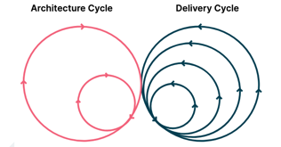

# 分解生命周期

分解生命周期模式是针对于软件开发生命周期的关注点分离。以在不同的时机，对于软件架构进行分析、治理和守护等。

## 背景

架构分析是一个复杂的问题，不同的利益相关者关注于不同的时机，诸如于架构师更关注于设计阶段、开发者更关注于开发阶段等。

## 问题

如何针对于不同的阶段，以进行更有针对性的治理？

## 解决方案

在不同的时机下，我们会有各自的关注点；针对于不同的关注点，我们会采用特定的工具进行治理和守护。如下表所示：

| **时机** | **关注点**             | **工具示例**                     |
|--------|---------------------|------------------------------|
| 设计态    | 架构设计                | UML, Feakin                  |
| 创建态    | 代码规范内建、规范执行机制、分层规范等 | 应用脚手架                        |
| 开发态    | 代码规范                | CheckStyle 的 Intellij IDEA插件 |
| 测试态    | 代码规范、分层架构、API 规范等   | ArchUnit                     |
| 集成态    | 质量门禁                | Sonarqube                    |
| 运行态    | 服务依赖                | Skywalking                   |

### 示例：ArchGuard

ArchGuard 中采用的三态模型：

- **设计态**：目标架构。通过 DSL（领域特定语言） + 架构工作台来构建 。
- **开发态**：实现架构。关注于：可视化 + 自定义分析 + 架构治理。
- **运行态**：运行架构。结合 APM 工具，构建完整的分析链。

### 局限性

如何融合不同的关注点，以构建完整性 => 需要采用架构适应度函数。

