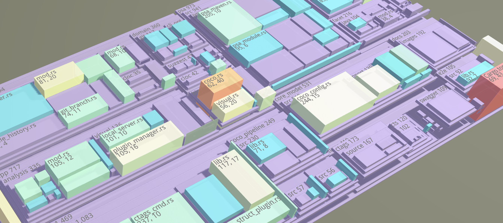

# 城市隐喻

## 解决方案

### 局限性

> 各种现有工具将动态分析信息从日志文件或在运行时提供给城市可视化事后剖析。无论哪种方式，动态信息在城市隐喻可视化中的利用都少得多。这可能更多是由于
难以提取细粒度的程序执行行为，而不是可视化研究人员如何描绘城市中的动态信息所面临的挑战。

### 结构

示例 Codecity：

> 城市隐喻依赖于软件结构和城市之间的相似性。研究人员以不同的方式实例化了城市隐喻，不同之处在于软件构建的方式及其通过城市隐喻在视觉上描述的特征。

#### Codecity 

示例 1：

每个平行六面体的视觉属性代表该类的软件指标：

- 建筑物的高度反映了方法数量（NOM）——建筑物越高，方法数量越多。
- 建筑物的基础大小对应于属性数（NOA）——基础越大，属性数越多。
- 建筑物的颜色映射到行数（LOC）——深蓝色表示几行代码，而浅蓝色表示多行代码。

块代表包。同一个包中的类放在同一个块中。根据包的嵌套级别，块的颜色范围从深灰色到浅灰色。

示例 2：[https://github.com/modernizing/codecity](https://github.com/modernizing/codecity)



- 颜色 => Git 变更，包括增加、删除、移动、重命名等，
- 大小 => LOC

```javascript
let CityInfo = {
  maxLines: 0,
  maxChanges: 0,
  pool: undefined
}
```

Feature Sets of City-Metaphor Visualizations:

| Tool                 | Language           | VR      | Building     | Src | Static                                                                   | Dymanic                   | Instr          |
|----------------------|--------------------|---------|--------------|-----|--------------------------------------------------------------------------|---------------------------|----------------|
| SoftwareWorld        | Java               | Maverik | function     | n/a | LOC, #methods, public/private, #parameters, param. types                 | n/a                       | n/a            |
| Componenty           | XML                | VRML    | component    | n/a | func. attributes                                                         | n/a                       | n/a            |
| CodeCity             | SmallTalk Java C++ | n/a     | class        | n/a | #methods, #attributes, package struct.                                   | n/a                       | n/a            |
| Vizz3D               | C/C++              | n/a     | function     | n/a | LOC, complexity, call graphs, contains, inheritance str. conn. comp.     | gprof                     | none (-pg)     |
| VizzAspectJ          | Java AspectJ       | n/a     | class aspect | n/a | #methods, #pointcuts #advices                                            | n/a                       | n/a            |
| EvoStreets           | Java               | n/a     | class        | n/a | module age, coupling, #dependencies, module size, last mod. date, author | n/a                       | n/a            |
| SynchroVis ExplorVis | Java               | Rift    | class        | n/a | inheritance, implementation, association                                 | instances calls thread op | Kieker traces  |
| CityVR               | Java/C++           | Vive    | class        | yes | LOC, #methods, #attributes                                               | n/a                       | n/a            |
| VR City              | Java               | Vive    | class        | yes | LOC, #methods, author, coupling                                          | trace loc.                | inTrace traces |
| Code Park            | C#                 | n/a     | class        | yes | size, method names                                                       | n/a                       | n/a            | 
| High-Rise            | Java               | n/a     | function     | no  | n/a                                                                      | time                      | ASM injection  |
| LD-City              | LD-R               | n/a     | (dynamic)    | n/a | #instance, #properties                                                   | n/a                       | n/a            |

研究方向：

- 附加静态信息
- 整合更多动态信息
- 多人共享观看
- 多语言城市可视化

## 参考资源

- 《The City Metaphor in Software Visualization》城市隐喻已成为可视化程序代码属性的流行方法。 本文概述了将此隐喻用于广泛的软件工程任务的研究项目。
到目前为止，使用城市隐喻的项目主要集中在可视化软件存储库的静态和半静态属性，例如了解程序的源代码结构如何随时间变化，以及谁在改变什么。
本文比较了这些现有的代码城市，并提出了未来研究的可能途径。
- 《On the use of virtual reality in software visualization: The case of the city metaphor》
