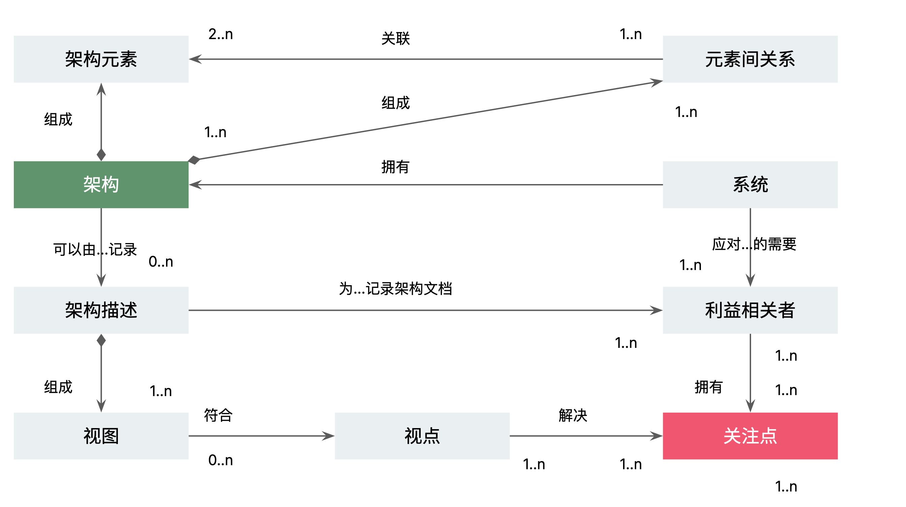
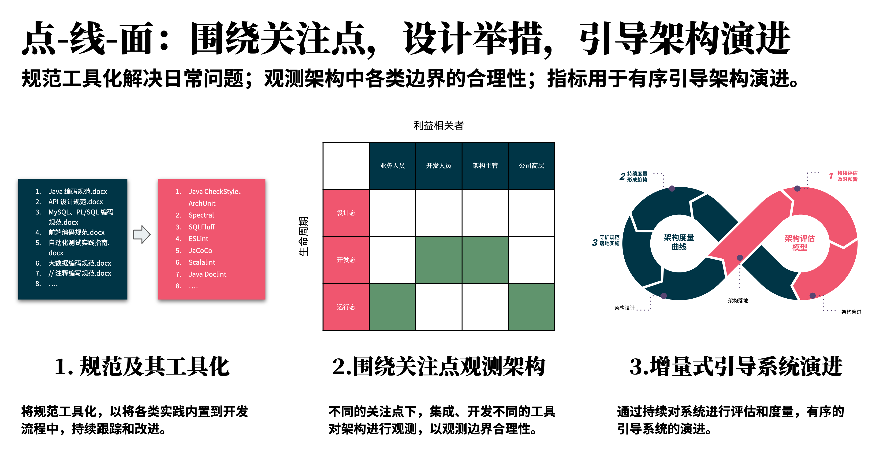

# 关注点驱动

## 问题

在一个复杂的系统中，我们如何管理不同的视图？

## 解决方案

在不同的视图中，我们可以将系统分解为不同的关注点，然后在不同的关注点中，我们可以将系统分解为不同的模块。

### 策略：架构是什么？如何将治理体系化？

关注点分离：将不同的系统模型分离到单独的描述中，独立关注系统的每一个方面。

### 策略：向视图应用视角，分解得到关注点

在不同类型的系统中，不同的视图的重要程度不一样，其关注点也不一样。

### 点-线-面：围绕关注点，设计举措，引导架构演进

规范工具化解决日常问题；观测架构中各类边界的合理性；指标用于有序引导架构演进。

## 参考资料

《软件系统架构：使用视点和视角与利益相关者合作》