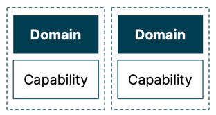

# 能力映射

能力是功能的构建块，不是以系统或团队的形式表达，而是以它们使某人能够做什么来表达。 能力代表组织需要能够做什么来执行其战略（Lynch
等人，2003 年）—— 能力可以通过构建、购买或重用公司内的现有产品来实现。

## 问题

## 解决方案

能力图由 4 层组成，从顶部开始，从客户开始。

- Customers 客户是指消费能力的人或服务。他们可能是内部或外部的。
- Product capabilities 产品能力描述了一个组织通过产品和功能向其客户，包括内部和外部客户提供的体验。
- Business capabilities 业务能力以其所做的事情来描述一个组织的运营模式。它们描述的是要做的事情，而不是实施的细节--事情是如何完成的。 每个业务能力都囊括了提供该能力的流程、数据、系统、事件和人员。
- Technology capabilities 技术能力是使公司能够建立、部署、监测和运行应用程序的基本构件。
- Channels 渠道（可选），如移动应用程序、网站、商店、社交媒体等，是一个促成因素，描述的是如何而不是什么，因此没有被放在能力图上。如果有意愿捕捉它们，就把它们和客户一起坐在上面。

每一层由 Domain 和 Capability 构建:

### 示例

