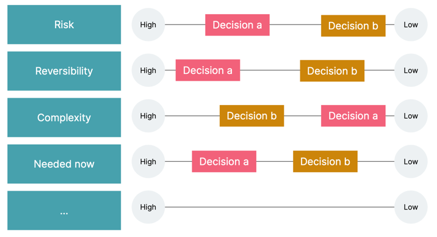

# 决策制定框架

> 决策制定框架帮助我们成为更好的决策者，消除情绪和偏见，并不仅根据预期结果（通常是默认结果）权衡决策，还考虑风险和对组织重要的其他特征。

## 问题

架构师的职责是：做出重大的技术决策。但作为人类，我们通常不擅长做决定。

## 解决方案

### 示例

1. 定义一组与需要做出决策的组织或领域相关的特征。

|      | 解决方案            |
|------|-----------------|
| 风险   | 决策涉及什么级别的风险？    |
| 可逆性  | 决定的可逆性如何？       |
| 复杂   | 这个决定会带来复杂性吗？    |
| 现在需要 | 现在需要做出决定还是可以推迟？ |

2. 根据每个特征从低到高评估决策。 

