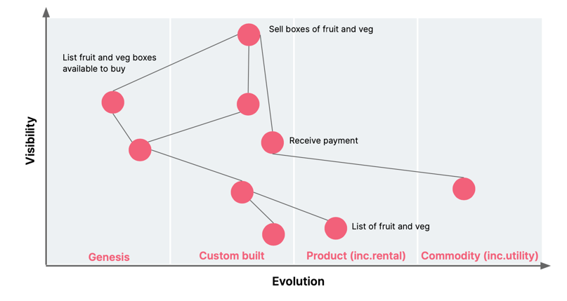

# X 技术描绘趋势

## 问题

如何向团队成员展示技术的广度和深度，以及技术的发展趋势？

## 解决方案

### 示例：内部技术雷达

> 内部技术雷达可视化组织对当前使用的技术的态度。 建造雷达将迫使人们围绕每项技术当前和未来的适用性展开对话。 让雷达保持最新和可见，
> 为与架构师和交付团队的对话提供了宝贵的核心内容。

### 示例：Wardley mapping

> Wardley Mapping 是一个战略框架和沟通工具。 Wardley Mapping 技术通过共享的视觉地图提高了对组织战略形势的认识。 
它使您能够深入了解用户的需求以及组织需要做什么才能为用户创造价值并高效运营。

进化轴：

- 起源 -（新手）不成熟的、不稳定的、独特的、不断变化的、新发现的。
- 定制 -（新兴）为特定环境单独制作和定制的东西。
- 产品 —（好）越来越普遍，通过可重复的过程制造，越明确，越容易理解。 这里的变化变得更慢。
- 商品 -（最佳）这代表生产的规模和批量操作，高度标准化、定义明确、固定不变。

示例：

